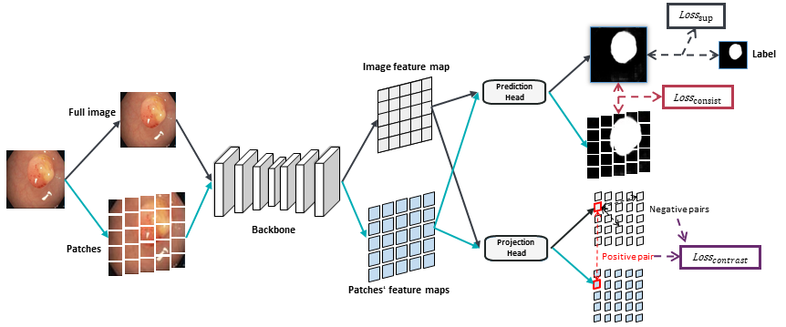

#  Cross-level Contrastive Learning and Consistency Constraint for Semi-supervised Medical Image Segmentation

##  Introduction

This repository contains the PyTorch implementation of:

Cross-level Contrastive Learning and Consistency Constraint for Semi-supervised Medical Image Segmentation, ISBI 2022.



##  Requirements

* torch
* torchvision 
* tqdm
* albumentations
* tensorboardX
* cv2
* numpy

##  Usage

####  1.Folder Structure
We except the data folder has these structures:
```
root/    
|-- data/
    |-- ISIC/
    |   |-- TrainDataset/
    |   |   |-- images/
    |   |   |   |-- ISIC_0000001.jpg 
    |   |   |   |-- ISIC_0000002.jpg 
    |   |   |   ...
    |   |   |-- masks/
    |   |       |-- ISIC_0000001.jpg 
    |   |       |-- ISIC_0000002.jpg 
    |   |       ...
    |   |-- ValidationDataset/
    |   |   |-- images/
    |   |   |   |-- ISIC_0000003.jpg 
    |   |   |   |-- ISIC_0000004.jpg 
    |   |   |   ...
    |   |   |-- masks/
    |   |       |-- ISIC_0000003.jpg 
    |   |       |-- ISIC_0000004.jpg 
    |   |       ...
    |   |-- TestDataset/
    |       |-- images/
    |       |   |-- ISIC_0000005.jpg 
    |       |   |-- ISIC_0000006.jpg 
    |       |   ...
    |       |-- masks/
    |           |-- ISIC_0000005.jpg 
    |           |-- ISIC_0000006.jpg 
    |           ...
    |-- Kvasir-SEG/
        |-- TrainDataset/
        |   |-- images/
        |   |   ...
        |   |-- masks/
        |       ...
        |-- ValidationDataset/
        |   |-- images/
        |   |   ...
        |   |-- masks/
        |       ...
        |-- TestDataset/
            |-- images/
            |   ...
            |-- masks/
                ...
```

####  2. Training

```bash
python main.py --config ./expconfigs/XXX.yaml
```

####  3. Testing

```bash
python main.py --config ./expconfigs/XXX.yaml --test
```


##  Citation

If you feel this work is helpful, please cite our paper

```
@article{zhao2022cross,
  title={Cross-level Contrastive Learning and Consistency Constraint for Semi-supervised Medical Image Segmentation},
  author={Zhao, Xinkai and Fang, Chaowei and Fan, De-Jun and Lin, Xutao and Gao, Feng and Li, Guanbin},
  journal={arXiv preprint arXiv:2202.04074},
  year={2022}
}
```


